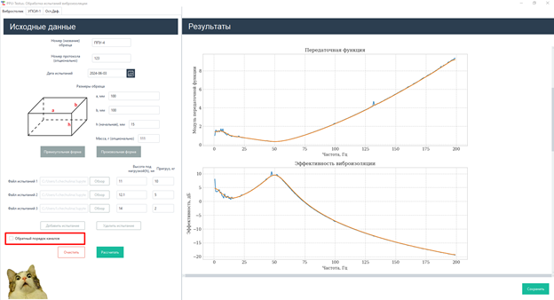

<div align="center">

# PPUTestus

**Desktop toolkit for processing mechanical test data of vibration‑isolation materials and auto‑generating measurement protocols.**



<sub><em>Raw sensor data on the left, computed transfer function and vibration‑isolation efficiency on the right — one click to the protocol.</em></sub>

[](https://www.python.org/)
[](https://ttkbootstrap.readthedocs.io/)
[](LICENSE)
[](#)
[](https://pyinstaller.org/)

</div>

---

## Overview

**PPUTestus** is a desktop application that turns raw laboratory measurements of elastic vibration‑isolation
materials (polyurethane‑foam pads, elastomers and similar damping elements) into ready‑to‑sign engineering
test protocols. It was built to replace a manual, spreadsheet‑driven workflow in a materials‑testing lab:
the engineer points the app at the raw sensor exports, fills in a short form, and receives the computed
mechanical characteristics, publication‑quality plots and a formatted Word report in seconds.

The application covers three independent test benches through a tabbed interface:

| Module | Bench | What it determines |
|--------|-------|--------------------|
| **Vibration table** (`Вибростолик`) | Dynamic shaker test | Transfer function, vibration‑isolation efficiency, resonance frequency, **dynamic modulus of elasticity** and **damping coefficient** |
| **UPSI‑1** (`УПСИ‑1`) | Static loading rig | Force–displacement response and **static stiffness / modulus** under stepped load |
| **Residual strain** (`Ост.Деф.`) | Long‑term load test | Permanent (residual) deformation after sustained loading |

## Key features

- **Signal processing pipeline** — reads multi‑channel accelerometer recordings (Ecofizika / EcoPhysics
  exports), computes spectrograms via FFT, derives transfer functions and vibration‑isolation efficiency,
  and locates resonance peaks with their half‑power bandwidth.
- **Mechanical characterisation** — calculates dynamic modulus of elasticity, damping coefficient and
  static stiffness from the measured response and specimen geometry.
- **Automated reporting** — fills parameterised Word templates (`docxtpl`) with results, embedded plots
  and a correctly declined Russian test date, producing a complete protocol per specimen.
- **Spreadsheet export** — writes structured results to `.xlsx` (`xlsxwriter`) for archival and further analysis.
- **Interactive GUI** — a responsive `ttkbootstrap` interface with scrollable, dynamically generated input
  forms, embedded Matplotlib figures and inline previews.
- **Standalone distribution** — packaged into a single Windows executable with PyInstaller, so lab operators
  run it without a Python installation.

## Tech stack

- **Language:** Python 3 (tested on 3.8–3.12)
- **GUI:** `ttkbootstrap` / `tkinter`
- **Numerical & signal processing:** `numpy`, `pandas`, `scipy.signal`
- **Plotting:** `matplotlib`
- **Reporting:** `docxtpl`, `python-docx`, `xlsxwriter`
- **Imaging:** `Pillow`
- **Packaging:** `pyinstaller`

## Project structure

```
PPUTestus/
├── main.py                 # GUI application: tabbed layout, forms, plot embedding, orchestration
├── Testus.py               # Core analysis: signal processing, mechanical calculations, exports
├── docGenerator.py         # Word‑protocol generation from templates
├── scrolled.py             # Custom ttkbootstrap widgets (scrollable frames, dialogs, animated GIF)
├── PPUTestus.spec          # PyInstaller build specification
├── *_Template.docx         # Word report templates
├── assets/                 # Icons, logos and UI images
├── Documentation/          # User manual and workflow diagrams
└── SR11(for test)/         # Sample measurement data for trying the app
```

## Getting started

### Run from source

```bash
# 1. Clone
git clone https://github.com/pokormi-kota/PPUTestus.git
cd PPUTestus

# 2. (Recommended) create a virtual environment
python -m venv .venv
.venv\Scripts\activate          # Windows

# 3. Install dependencies
pip install ttkbootstrap numpy pandas scipy matplotlib docxtpl python-docx xlsxwriter pillow

# 4. Launch
python main.py
```

### Build a standalone executable

> **This is the preferred way to ship the app.** It is meant to be used by engineers, not computer
> scientists — a single double‑clickable executable means no Python, no virtual environment and no
> `pip install` on the lab machine.

```bash
pip install pyinstaller
pyinstaller PPUTestus.spec
```

The bundled application is produced in `dist/`.

## Typical workflow

1. Select the test type tab (vibration / static / residual strain).
2. Enter specimen geometry (dimensions, height) and the load steps used in the test.
3. Point the app at the raw sensor exports for each load.
4. Run the calculation to view transfer functions, efficiency curves and computed characteristics.
5. Export the results to Excel and generate the formatted Word protocol.

A full user manual (Russian) is available in [`Documentation/`](Documentation/).

## Documentation

The `Documentation/` folder contains the user guide (`PPUtestus инструкция пользователя.pdf`) and
workflow / data‑flow diagrams describing the processing pipeline for each bench.

## A little fun on the side

Forget to fill in some input data before hitting **Calculate**? The app won't just throw a stack trace at
you — it answers with a randomly chosen meme. A small touch added to make a lab engineer's repetitive day
a little less boring.

<div align="center">


</div>

## License

Released under the [MIT License](LICENSE) © 2024 pokormi‑kota.

---

<div align="center">
<sub>Built to streamline a real materials‑testing laboratory workflow — from raw sensor data to signed protocol.</sub>
</div>
